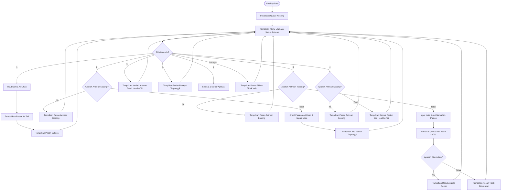

# Dokumentasi Sistem Antrean Klinik (Queue - FIFO)

Dokumen ini berisi penjelasan konsep, flowchart sistem, diagram struktur queue, dan contoh output program sebagai penunjang tugas kuliah/UAS Struktur Data.

---

## 1. Penjelasan Konsep FIFO pada Sistem Antrean Klinik

**FIFO (First In First Out)** atau *Pertama Masuk Pertama Keluar* adalah prinsip dasar dari struktur data antrean (Queue). Konsep ini menyatakan bahwa elemen yang pertama kali dimasukkan ke dalam antrean akan menjadi elemen yang pertama kali dikeluarkan.

Pada **Sistem Antrean Klinik**:
- **Enqueue (Tambah Pasien)**: Ketika seorang pasien baru mendaftar di klinik, data pasien tersebut dimasukkan ke ujung belakang antrean (**Tail**). Pasien harus menunggu giliran di belakang pasien lain yang sudah datang terlebih dahulu.
- **Dequeue (Panggil Pasien)**: Ketika dokter siap melayani pasien berikutnya, pasien yang berada di urutan paling depan (**Head**) yang akan dipanggil terlebih dahulu. Setelah dipanggil, data pasien tersebut dihapus dari antrean karena telah selesai diproses.
- **Analogi**: Sama seperti antrean riil di loket pendaftaran klinik. Pasien yang datang lebih awal (masuk pertama) akan dilayani lebih dulu (keluar pertama).

---

## 2. Diagram Struktur Queue

Berikut adalah visualisasi struktur data Queue yang diimplementasikan menggunakan **Singly Linked List**:

```
[ Head ]                                                      [ Tail ]
   |                                                             |
   v                                                             v
+---------------+     next     +---------------+     next     +---------------+
| Pasien 1 (1)  | -----------> | Pasien 2 (2)  | -----------> | Pasien 3 (3)  | ---> None
| Budi Santoso  |              | Siti Aminah   |              | Joko Widodo   |
| Sakit Kepala  |              | Flu & Demam   |              | Sakit Gigi    |
+---------------+              +---------------+              +---------------+
       |                                                             |
       v                                                             v
  (Dihapus saat                  (Proses Transisi)              (Ditambahkan
    Dequeue)                                                    saat Enqueue)
```

**Keterangan**:
- **Head**: Menunjuk ke Node terdepan (Pasien 1). Proses `dequeue` dilakukan pada pointer Head ini.
- **Tail**: Menunjuk ke Node paling belakang (Pasien 3). Proses `enqueue` dilakukan dengan menyambungkan pointer `next` dari Tail lama ke Node baru, lalu memindahkan pointer Tail ke Node baru tersebut.
- **Node**: Representasi objek pasien yang saling terhubung satu arah (`next`) dan berakhir pada `None`.

---

## 3. Flowchart Sistem

Berikut adalah alur jalannya program dari awal hingga keluar aplikasi menggunakan diagram alir (flowchart):



---

## 4. Contoh Output Program

Berikut adalah simulasi tampilan menu utama dan output program pada setiap skenario fitur:

### A. Tampilan Menu Utama (Awal)
```
============================================================
       🏥  SISTEM ANTREAN KLINIK SEHAT SENTOSA  🏥        
============================================================
 📊 STATUS ANTREAN:
   • Kapasitas  : [○ ○ ○ ○ ○] (0/5 Pasien)
   • Terdepan   : - (Antrean Kosong)
┌──────────────────────────────────────────────────────────┐
│ 📋 MENU UTAMA:                                           │
├──────────────────────────────────────────────────────────┤
│ [1] Tambah Pasien Baru (Enqueue)                         │
│ [2] Panggil Pasien Berikutnya (Dequeue)                  │
│ [3] Cari Data Pasien                                     │
│ [4] Tampilkan Daftar Antrean                             │
│ [5] Informasi Detail Antrean                             │
│ [6] Riwayat Pasien Terpanggil                            │
│ [7] Keluar Aplikasi                                      │
└──────────────────────────────────────────────────────────┘
Pilih menu [1-7]: 
```

### B. Tambah Pasien (Enqueue)
```
>>> TAMBAH PASIEN (ENQUEUE)
--------------------------------------------------
Masukkan Nama Pasien: Joko Widodo
Masukkan Keluhan Pasien: Sakit Gigi

✔ Sukses! Pasien Joko Widodo terdaftar dengan Nomor Pasien: 3

Tekan Enter untuk kembali ke menu...
```

### C. Panggil Pasien Berikutnya (Dequeue)
```
>>> PANGGIL PASIEN BERIKUTNYA (DEQUEUE)
--------------------------------------------------
📢 MEMANGGIL PASIEN:
   Nomor Pasien: 1
   Nama Pasien : Budi Santoso
   Keluhan     : Sakit Kepala

✔ Pasien telah dipanggil dan keluar dari antrean aktif.

Tekan Enter untuk kembali ke menu...
```

### D. Cari Data Pasien
```
>>> CARI DATA PASIEN
--------------------------------------------------
Masukkan Nomor Pasien atau Nama: Siti

✔ Ditemukan 1 pasien:
   ┌──────────────────────────────────────────────┐
     Urutan    : 1
     No. Pasien: 2
     Nama      : Siti Aminah
     Keluhan   : Flu & Demam
   └──────────────────────────────────────────────┘

Tekan Enter untuk kembali ke menu...
```

### E. Tampilkan Seluruh Antrean
```
>>> TAMPILKAN SELURUH ANTREAN
--------------------------------------------------
Daftar Pasien di Antrean (Depan -> Belakang):
   ┌──────────────────────────────────────────────┐
     Urutan    : 1
     No. Pasien: 2
     Nama      : Siti Aminah
     Keluhan   : Flu & Demam
   └──────────────────────────────────────────────┘
   ┌──────────────────────────────────────────────┐
     Urutan    : 2
     No. Pasien: 3
     Nama      : Joko Widodo
     Keluhan   : Sakit Gigi
   └──────────────────────────────────────────────┘

Tekan Enter untuk kembali ke menu...
```

### F. Riwayat Pasien Terpanggil
```
>>> RIWAYAT PASIEN TERPANGGIL
--------------------------------------------------
Daftar Riwayat Terpanggil (Terbaru -> Terlama):
   ┌──────────────────────────────────────────────┐
     Urutan    : 1
     No. Pasien: 1
     Nama      : Budi Santoso
     Keluhan   : Sakit Kepala
   └──────────────────────────────────────────────┘

Tekan Enter untuk kembali ke menu...
```
